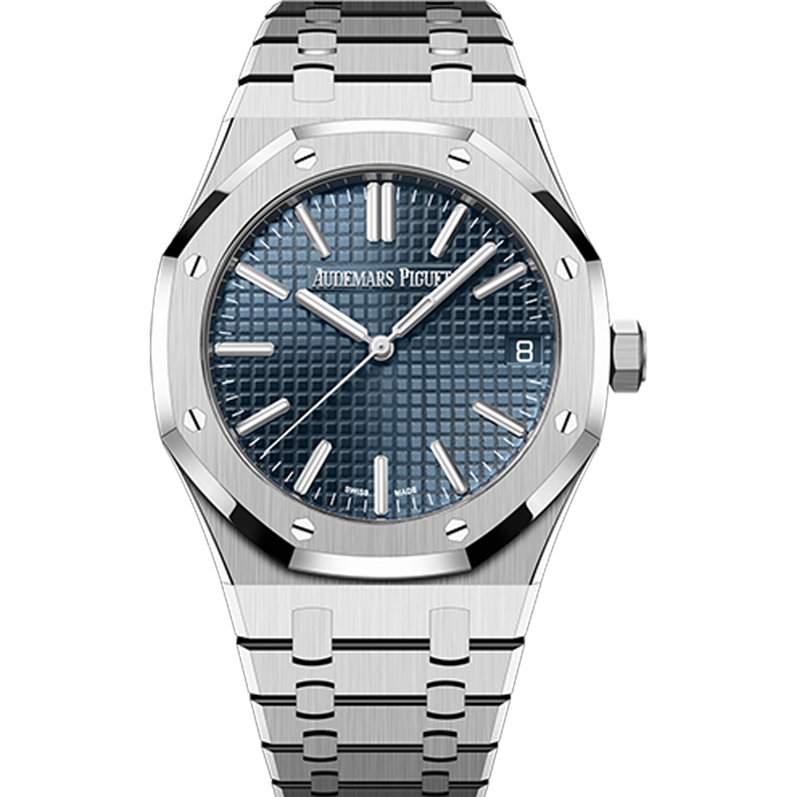
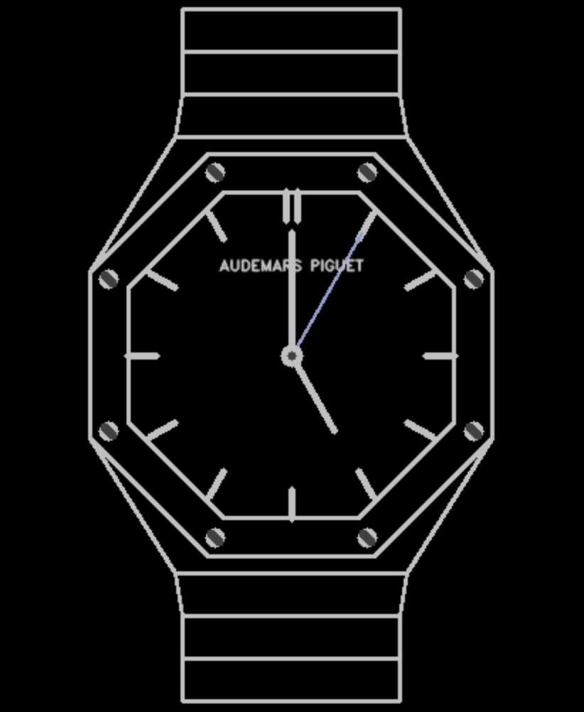

# OpenCV Clock: Audemars Piguet Royal Oak 🕰️

This is a simple clock made with OpenCV which replicates the iconic Audemars Piguet Royal Oak watch. It displays the current time and updates every second.

## Preview

### Inspiration

<div align="center">
  
</div>

### Final Product

<div align="center">
  
</div>

## Features

- 🕒 Displays the current time
- 🔄 Updates every second
- 🎨 Replicates the Royal Oak chronograph watch
- ✅ Works using functions and almost no dependencies

## Running the code

```bash

# Create a virtual environment
python3 -m venv venv

# Activate the virtual environment
source venv/bin/activate

# Install the dependencies
pip install -r requirements.txt

# Run the code
python clock.py
```

## Contributing

If you have any suggestions or improvements, please create a pull request or open an issue. Add any watch or feature you want!
